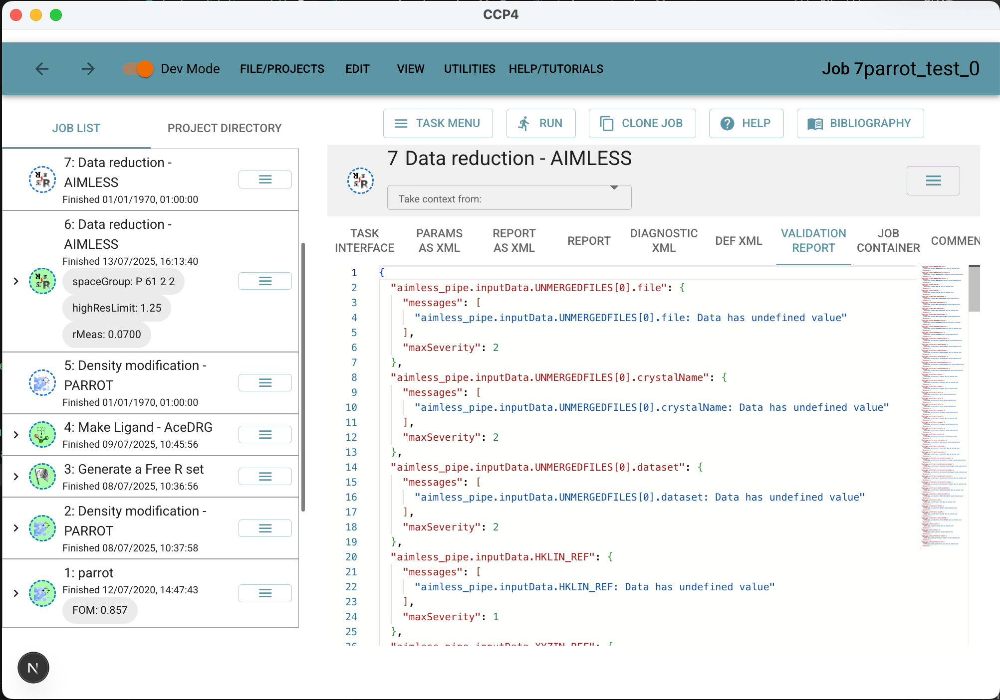

# Task validation

By default, task validation occurs on the server using the built in `CCP4i2` validation of of the task. Parameters controlling this validation are defined in the task's `.def.xml` file. A view of the prevailing validation report can be seen by engaging `developer mode` and looking at the relevant tab in the job view.



`ccp4i2-django` provides a mechanism to override this default validation to 1) remove validation issues based on the current state of the interface, 2) identify additional validation issues based on the current state of the interface, or 3) add additional user elements to the run-confirmation dialog.

## 1. Removing validation issues to enable running

An example: The default validation of an `aimless-pipe` plugin considers there to be an error if the elements of the parameter `aimless_pipe.controlParameters.CELL` are not set. This behaviour reflects a limitation in the `.def.xml`-based validation in expressing requirements that may not apply depending on other parameters of the task. This issue has an associated `maxSeverity` of 2, which would normally inhibit task execution. To intercept and nullify the issue, the task sets a callback to process task issues:

Firstly additional imports

```tsx
// Imports
import { useContext } from "react";
import type { ProcessErrorsCallback } from "../../../providers/run-check-provider";
import {
  RunCheckContext,
  useRunCheck,
} from "../../../providers/run-check-provider";
```

Then code within the Functional component definition:

```tsx
// 1. Retrieve the function for installing the processing callback from the relevant context
// layer

const { setProcessErrorsCallback, processErrorsCallback } =
  useContext(RunCheckContext);

// 2. Define an error processing callback.  In this case filters out issues with
// aimless_pipe.controlParameters.CELL.
const myProcessErrorsCallback = (validation: any) => {
  //Null action for validation null or undefined
  if (!validation) return validation;
  // Filter out keys that start with "aimless_pipe.controlParameters.cells"
  const filteredValidation = Object.keys(validation)
    .filter((key) => !key.startsWith("aimless_pipe.controlParameters.CELL."))
    .reduce((acc, key) => {
      acc[key] = validation[key];
      return acc;
    }, {} as any);

  return filteredValidation;
};

// 3. Use a useEffect to install the filtering callback, and clean up when the task interface
// unmounts

useEffect(() => {
  //Proceed only if the callback is not already set
  //This is to avoid setting the callback multiple times, which could lead to unexpected behavior
  //and to ensure that the callback is set only once when the component mounts
  if (!processErrorsCallback) {
    //Notice the esential (but unusual) syntax of the following line
    //This is a function that will be called to process errors, and it will filter out
    //any errors that are related to the cell parameters of the aimless_pipe task
    setProcessErrorsCallback(() => myProcessErrorsCallback);
  }
  return () => {
    if (processErrorsCallback) setProcessErrorsCallback(null);
  };
}, []);
```
