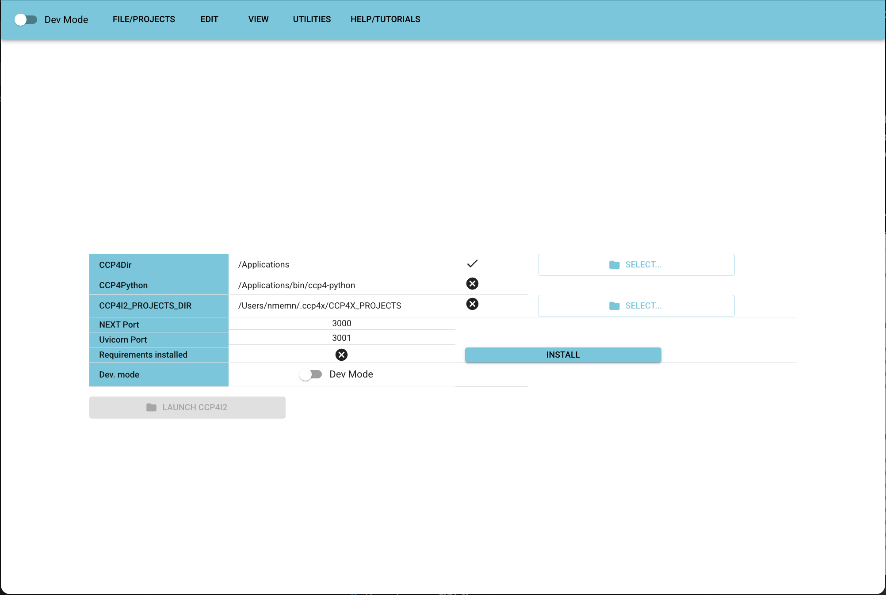

# Getting started

## First launch

Upon first launch, you will see a splash screen where you can configure 1) the location of your dedicated ccp4 instance, and 2) a default directory in which your project files will be stored (although this can be overridden when projects get created ):



A cross in the line `CCP4Dir` indicates that the current value does not exist, while a cross in the `CCP4Python` line indicates that the currently selected CCP4Dir does not contain a suitable `bin/ccp4-python` (MacOS/linux) or `bin/ccp4-python.bat` (windows) executable file. Browsing to locate the top level of your dedicated CCP4 instance should make both of these change from crosses to ticks.

A cross in the `CCP4I2_PROJECTS_DIR` line indicates that the currently selected default project directory does not exist. Browse to locate a new empty directory where most of your projects will be stored. _DO NOT_ use the CCP4I2_PROJECTS folder where your classic CCP4i2 projects are stored.

A cross in the `Requirements installed` line indicates that the additional python dependencies of `ccp4i2-django` have not yet been installed. To attempt installation, click the `INSTALL` button.

When there are ticks instead of crosses across the board, it is possible to click the `LAUNCH CCP4i2` button

# Trouble shooting

## 1. Creating or selecting a default projects directory fails:

_For now_, you may not be able to create the default project-container directory from within the app, in which case you would be encouraged to create a directory for storing your projects manually in a terminal. e.g.

```sh
mkdir /Users/nmemn/.ccp4x
mkdir /Users/nmemn/.ccp4x/CCP4_PROJECTS # This is the directory that you will subsequently configure in the launch page
```
